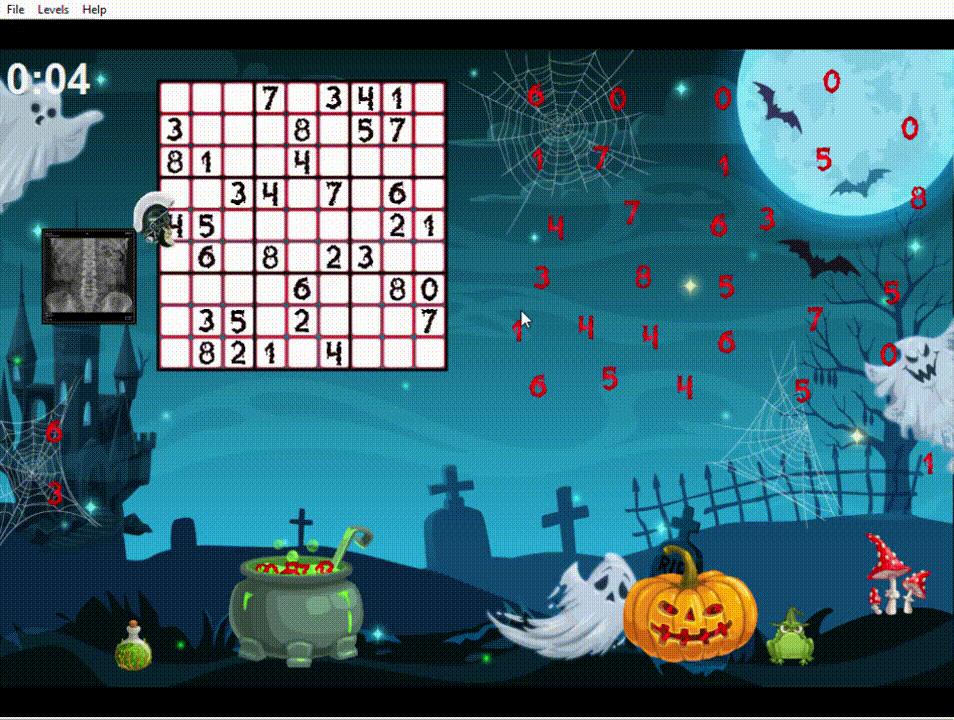
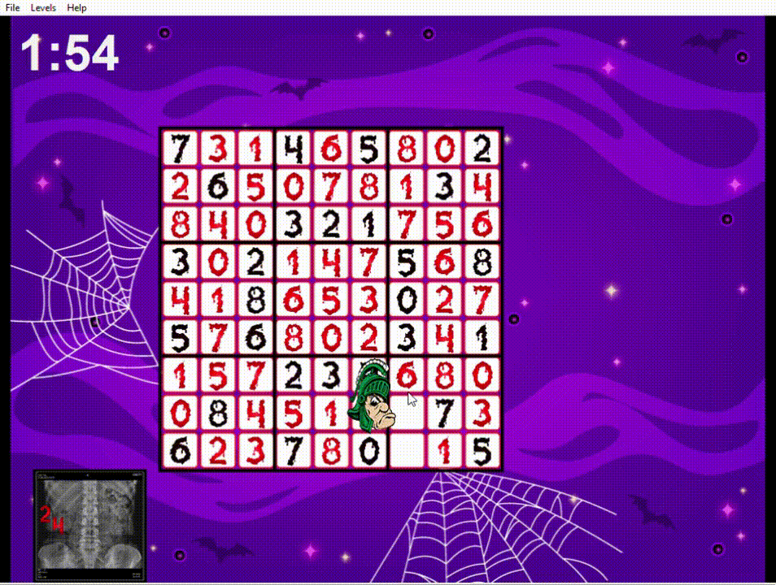
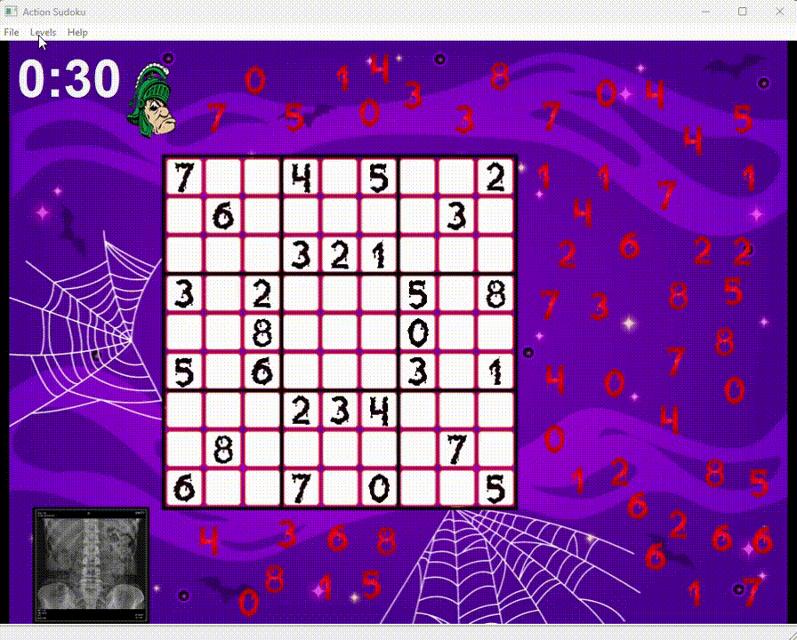

## Sudoku Game (C++ / wxWidgets)
A feature-rich Sudoku game implemented in C++ with wxWidgets, designed as part of a team project for an Object-Oriented Design class. This project demonstrates advanced OOP principles, design patterns, and large-scale software organization.

### Overview
-   Three sudoku puzzles with interactive gameplay mechanics 
	-   “Eat” numbers scattered on the board using a school mascot character
	-   Store numbers in the mascot’s tummy and “regurgitate” them onto the Sudoku grid 
	-   Limited number storage and timer-based challenges
	-   Solve button if stuck on a level for too long
---

### Tech Stack
- C++
- wxWidgets
---

### Project Setup
##### Note: This project requires the **same versions of wxWidgets and compiler settings** used in the original development for full functionality
 1. Clone the repository

    git clone https://github.com/Keerthi598/Sudoku.git

 2. Open the project in CLion (or compatible IDE with wxWidgets configured)
    
 3. Build and run the game

---
This project was originally developed as part of a team-based Object-Oriented Design course, but the repository showcases the core game logic, architecture, and documentation authored independently.

---

